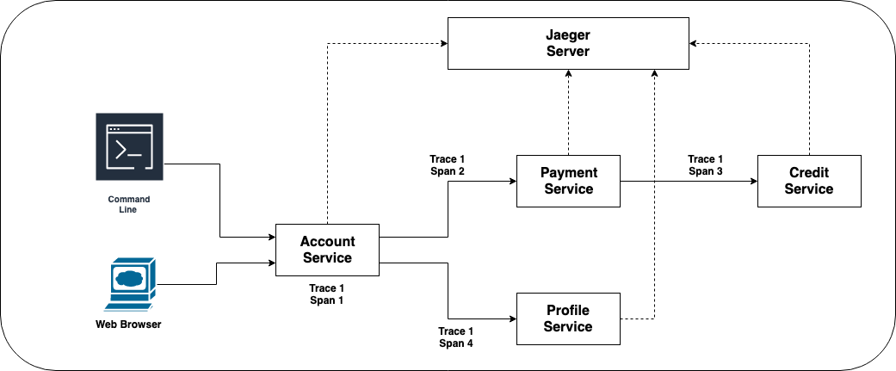
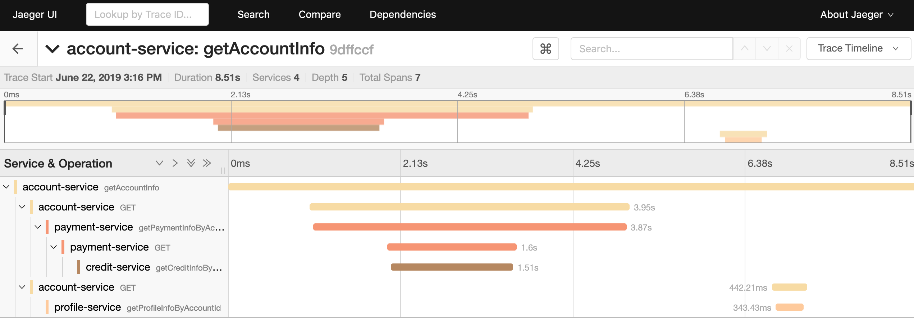
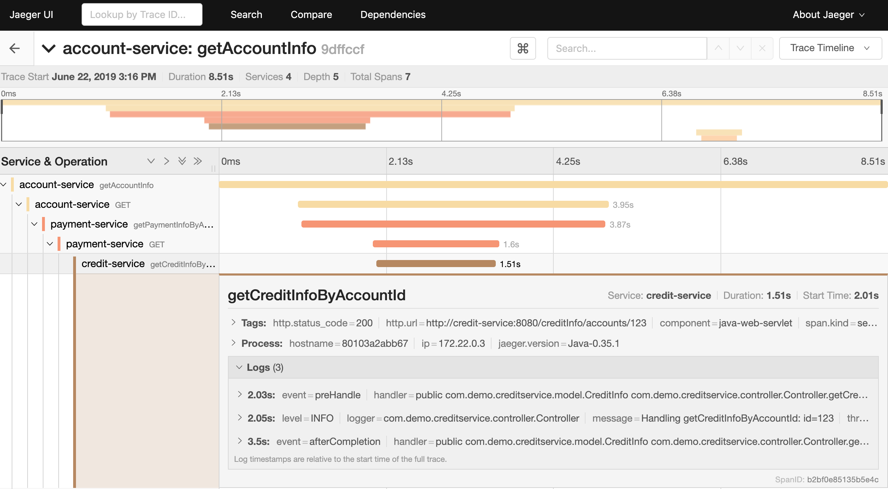
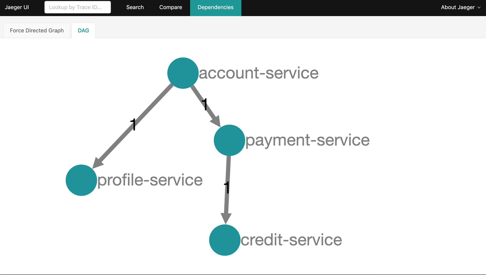

# Distributed Tracing For Spring Boot Applications Using Jaeger

## Goal

The goal of this repository is to illustrate how to leverage Jaeger as the distributed tracing solution for Spring Boot applications.

With little configuration, trace information is passed between services and reported to Jaeger server and you can see the trace information in the Jaeger UI.

## Contrived Example

In this repo, ideas and solutions are illustrated by applying them to a contrived example. There is not much real business related functionality implemented and the idea of the example is to have multiple services working together to loosely reflect a real world scenario.

There are 4 different services in this example. `Account Service` is the main service to which client (browser) interacts with. `Account Service` in turns calls `Payment Service` and `Profile Service` for the relevant information for the requested account id. `Payment Service`, upon receiving the request, will also calls `Credit Service` for the information. A random delay is added to each service's processing to simulate the time used in processing the business logic.




## Building The Services

Inside the repository, each sub-directoy contains the source code for each service. Execute the maven command in each sub-directory to build each service

```
mvn clean verify
```

Alternatively, a `Dockerfile` is provided for each service. Execute the following command to build and containerize the service.

```
docker-compose -f docker-compose.yaml build
```

## Running The Services

First of all, stand up `Jaeger` server

```
docker-compose -f docker-compose-infra.yaml up -d
```

The, run the services

```
docker-compose -f docker-compose.yaml up -d
```

## Generate Traces

```
curl http://localhost:8080/accounts/123
```

`123` is the account id, any number will do.


## Oberserve the Trace

Jaeger is available at `http://localhost:16686/`


From the left panel, select `account-service` from the `Services` dropdown list and click the `Find Traces` button.

All available traces will show up on the main panel. Click any trace to dive into details.



Click a span will provide details about that particular span



Jaeger will also analyze the trace and provide the dependency graph.




## Continuous Integration: Google Cloud Build

A Cloud Build `cloudbuild.yaml` file has been provided and the github repository has been configured to have a build triggered every time there is a commit pushed to any branch.

Inside `cloudbuild.yaml`, a Docker Cloud Builder is used to execute the `docker build` command for each service using the respective `Dockerfile`.

It is possible to extend this file to also push container image to a container registry such as GCR. 

## Continuous Integration: Gitlab CICD

A `.gitlab-ci.yaml` file has been provided such that a build will be triggered every time a commit is pushed to any branch. What it currently does is to build each service using the provided `Dockerfile. It is possible to extend current pipeline to push container images to container register or deploy to target environment.